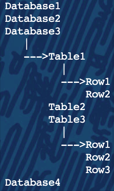

# Basics of Relational Databases

What are RDBMS's

RDBMS’s were developed decades ago to manage the underlying storage and organization for all of the information bits and their relationships.
Examples include: MariaDB, MySQL, Oracle, Postgresql, mSQL, SQLServer
There is even a special language that was invented to interact with relational databases, known as the Structured Query Language, or SQL. Most RDBMS’s implement some form of SQL. Further discussion of SQL to occur in a later lecture.

Data Relationships

Why does everyone always talk about data relationships and relational databases? What’s all this relationship business?
Easy! Most information that humans care about is related somehow. One piece of information logically ties to another.

Consider the following:
 - Accounting systems: accounts, transactions, customers
 - Recipes: ingredients, processes, categories
 - Movie collections: Titles, genres, actors, ratings

Most requirements to store data can done by expressing the various entities of information and then expressing the relationships between them.

For a given Movie, there will be:
 - A Title
 - One or more Genres
 - One or more Actors
 - etc...

Vocabulary Time

- Database: Highest level container. Holds zero or more tables, views, stored procedures, etc. “Movie Collection”
- Table: Primary data storage container. Holds zero or more rows of information, each row representing one collection of data bits and relationships. “Titles”
- Row: Individual chunk of data, comprised of one or more columns of information. “id: 2600, title: Hackers”
- Column: One tiny part of data in a row. “Hackers”

Basic Structure

