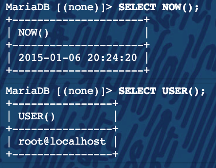

# MySQL Basics

**MySQL Components**

- mysqld: The server process, providing most of the functionality expected from an RDBMS.
- mysqld_safe: The startup script that is used to run mysqld, and pass it command line options.
- Libraries/Connectors: There are several MySQL libraries(PHP) which can be used by developers to connect custom source code to the MySQL system, allowing full access to databases managed by a local or remote mysqld.

**MySQL Clients/Utilities**

- mysql: Important command line interface client, connecting to MySQL servers locally or remotely.
- mysqladmin: Administration tool
- mysqldump: Backup tool
- mysqlcheck: Table maintenance and repair tool
- myisamchk: MyISAM maintenance tool
- mysqlshow: View databases, tables and column information
#
**Proper Startup Procedures**

     [root@mysql ~]# systemctl enable mariadb.service

     [root@mysql ~]# systemctl start mariadb.service

     [root@mysql ~]# systemctl status mariadb.service
  
#
**Proper Shutdown Procedures**

Shutting down a database properly is one of the most important steps in avoiding corruption. Consider:
 - Open files
 - Ongoing transactions
 - Database caches, operating system caches, hardware caches

If the database is not given a chance to "flush out" (write to disk) caches, write out log messages and close out all operations, any number of nasty corruption issues can spring up.
In dire cases, sending SIGTERM to mysqld will also provide MySQL with notice and the time to shut down cleanly.
#
**Connecting to MySQL Server**

In a later lecture, we will discuss users and access control within MySQL. For the time being, we will be logging in to MySQL server with the default root account.

To attach to the MySQL server, simply run:

     [root@mysql ~]# mysql -p -u root 
 
This tells the mysql command line client to connect to the locally running mysqld process as the root user ( -u ), and prompt for the password ( -p ).
#
**What is a Query?**

In SQL, the term 'query' simply means ANY request. This can be a request to show server variables, input information into a database, or show previously entered data.

Queries to a database server can be as simple or complex as needed. For example:

# Lab Time!

- Start up your database, connect as root and try out the examples mentioned previously. What is the difference between ending a query with a semicolon or backslash G?
- Try running “\h” or “\?”. Figure out how to exit from the mysql client, then shutdown your database. Verify you can no longer connect via the mysql client. Read the documentation for mysqladmin, then run “mysqladmin ping” and verify your server is shut down.
- Start up your database once more and check that it’s running both with mysql and mysqladmin.

