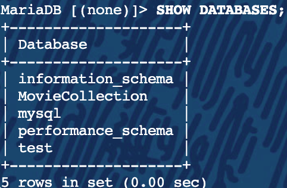

# SQL Language Basics

SQL

The Structured Query Language is a powerful tool for interfacing with RDBMS’s.
SQL is not the most straightforward language, though, as the syntax is strict, and the wording a little foreign for first time users.

Note: In SQL, it is best practice to capitalize reserved words and functions, such as:

 - Reserved words: SHOW, SELECT, INSERT, DELETE, DROP, CREATE
 - Functions: PASSWORD(), NOW(), DATE(), USER()

Using the Documentation

Now is a good time to learn about the vast and excellent documentation available for the MySQL and MariaDB systems.

https://mariadb.com/kb/en/mariadb/documentation/

http://dev.mysql.com/doc/

Peruse at your leisure the documentation and familiarize yourself with the layout of the site. Maybe read up on the mysql or mysqladmin command.

Using SHOW

The SHOW command is extremely useful for gathering information from the database server. There is an entire page of documentation based around the information you can request.

http://dev.mysql.com/doc/refman/5.5/en/show.html

Some Common SHOW commands include PROCESSLIST, ENGINES, SLAVE STATUS, DATABASES, TABLES, etc.

The CREATE Command

CREATE is one of the data definition language (DDL) statements. DDL statements manipulate database structures. Other DDL statements include ALTER, DROP, and TRUNCATE.

https://mariadb.com/kb/en/innodb-online-ddl-overview/

CREATE can be used to create a number of different RDBMS entities. A few examples would be DATABASE, TABLE, VIEW, INDEX, etc.

Using CREATE DATABASE

We first need to create a database container for our Movie Collection project:

        MariaDB [(none)]> CREATE DATABASE MovieCollection;

        Query OK, 1 row affected (0.00 sec) 

The name is case sensitive, so we shall use capital letters to denote each word.
Database naming is a personal or organizational policy decision. MySQL truly does not care what the name is, so long as it follows the rules laid out in the documentation “Schema Object Names”.

Using a Database

If connecting to a MySQL/MariaDB server without specifying a database, no database is used.

    [root@mysql ~]# mysql
    Welcome to the MariaDB monitor.  Commands end with ; or \g.
    Type 'help;' or '\h' for help. Type '\c' to clear the current input statement.
    MariaDB [(none)]> SELECT DATABASE();
    +------------+
    | DATABASE() |
    +------------+
    | NULL       |
    +------------+
In SQL, the term NULL means there is an absence of information.

Now that the MovieCollection database has been created, we need to let the mysql client know that is the database we want to work on. This is done with the mysql client “USE” command.
    
      [root@mysql ~]# mysql
      MariaDB [(none)]> USE MovieCollection;
      Database changed
      MariaDB [MovieCollection]> SELECT DATABASE();
      +-----------------+
      | DATABASE()      |
      +-----------------+
      | MovieCollection |
      +-----------------+
      MariaDB [MovieCollection]> exit
      [root@mysql ~]# mysql MovieCollection
      MariaDB [MovieCollection]>

  CREATE TABLE

Now that a working database exists, we can begin to add tables to that database
Remember that "CREATE TABLE" and "CREATE DATABASE" are both DDL statements, but control different structures.
Creating tables involves naming the table and describing the various column names and types.

Generic syntax:

     CREATE TABLE table_name (
        column_name column_type_and_parameters,
        ...
     );

  MOVIE Table

  This is a sample CREATE TABLE command.
  
      CREATE TABLE movie (
           -> id          INT UNSIGNED   NOT NULL    AUTO_INCREMENT, PRIMARY KEY ( id ),
           -> title       VARCHAR(50)    NOT NULL,
           -> acquired    DATETIME,
           -> borrow_id   INT
           -> );
      Query OK, 0 rows affected (0.07 sec)

You can see that there is a lot more information that goes into creating the table then the database itself. This is because the DATABASE is simply a container, whereas the TABLES hold the bulk of the data. Let's take a look at some of the values we gave the CREATE TABLE:

INT: A number up to 10 digits long

INT UNSIGNED: A POSITIVE number up to 10 digits long

NOT NULL: This field cannot be empty

AUTO_INCREMENT: This field will always grow by one number(1, 2, 3, etc)

PRIMARY KEY (column): This field uniquely identifies each row in a table. Usually used with AUTO_INCREMENT.

VARCHAR(): This means a value that is alphanumeric, up to () characters long

DATETIME: This field tells the database that the value of this entry must be a date string. If not specified, it will use the current date and time.

Using the DROP Statement

When a table, database or any other structure in the RDBMS needs to be completely removed, this is done with the DROP statement:

    DROP structure_type name;
    
Example:

    DROP TABLE genre;
    DROP DATABASE MovieCollection;
    
This will completely remove the genre table and all data in it.

This is irreversible! Be very careful with the DROP statement!

# Lab Time!

- Create the person and movie tables for the MovieCollection database using the following schema
- Verify that both tables are listed under the MovieCollection database using the SHOW command

